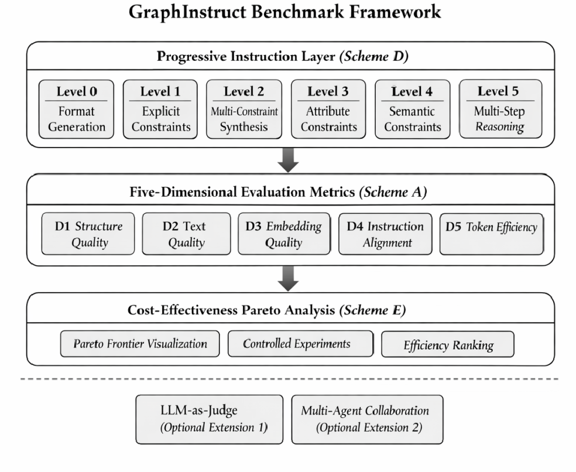

# GraphInstruct

> A progressive-complexity benchmark for diagnosing capability gaps in LLM graph generation.
> NeurIPS 2026 · Evaluations & Datasets Track · Anonymous Authors

[](LICENSE)
[](docs/DATA_LICENSE.md)
[](pyproject.toml)
[](https://neurips.cc/Conferences/2026)
[](tests/)

---

## ✨ Why GraphInstruct?

LLMs are increasingly used as on-demand graph synthesizers, yet existing
graph-LLM benchmarks stratify along graph type, task domain, or classical
algorithm—axes that average over the structural-complexity dimension that
actually governs failure. **GraphInstruct closes this diagnostic gap**:

- **800 hand-authored instructions** stratified into 6 progressively-constrained
  complexity levels (L0 format → L5 multi-step graph editing)
- **5 evaluation dimensions** (D1 structural · D2 textual · D3 embedding ·
  D4 instruction-match · D5 efficiency), all deterministic, **zero LLM-as-judge**
- **12-LLM × 4-strategy capability survey** (180 K outputs) reveals where in the
  complexity spectrum each model breaks
- **Verification-Guided Iterative Generation (VGIG) + Constraint-Aware Adaptive
  Prompting (CAAP)** surpass the per-level prompt-engineering oracle by
  +0.035 to +0.050 across three target models



---

## 🚀 Quickstart (5 minutes)

```bash
# Windows users only: avoid OMP runtime conflict + GBK encoding crashes
export KMP_DUPLICATE_LIB_OK=TRUE
export PYTHONIOENCODING=utf-8

# 1. Get the code: download as zip from the anonymous review URL
#    https://anonymous.4open.science/r/GraphInstruct_formal-3272
#    (post-acceptance: a public GitHub URL will replace this line)
cd GraphInstruct
pip install -e .

# 2. Verify with 418 unit tests (~30 s)
python -m unittest discover -v -s tests

# 3. Open the interactive notebook (5-min hands-on tour)
jupyter notebook examples/01_quickstart.ipynb
```

For a deeper dive, see [`docs/INSTALL.md`](docs/INSTALL.md) and
[`docs/REPRODUCE.md`](docs/REPRODUCE.md).

---

## 📁 What's in this repository?

| Directory | What | Used for |
|-----------|------|----------|
| `data/instructions/` | 800 instructions in 6 JSON files (L0–L5) | The benchmark itself |
| `data/reference_pools/` | 4,163 reference graphs (3,115 synthetic L3 + 1,048 real-world L4) | D1 / D3 distributional metrics |
| `graphinstruct/` | Python package: parser, validators, D1–D5 metrics, scoring, VGIG/CAAP | Importable evaluation pipeline |
| `tests/` | 418 unit tests across 14 files | Verifying correctness |
| `scripts/` | 7 production CLI tools (baseline runner, ablations, visualization) | Reproducing paper tables |
| `results/` | Per-cell quality scores, leaderboard CSVs | Direct evidence for paper Tables 1, 2, 3 |
| `figures/` | All 21 paper figures as PNG/JPEG | Inspect results without running code |
| `examples/` | 2 Jupyter notebooks (quickstart + evaluate-your-model) | Onboarding new users |
| `docs/` | INSTALL · REPRODUCE · DATA_README · DATA_LICENSE · DATASHEET | Detailed documentation |

---

## 🔬 Reproduce the paper

Three reproduction tiers depending on the depth of verification you want:

| Tier | What you reproduce | Compute | API cost | Time |
|------|--------------------|---------|----------|------|
| **A** | Data integrity + parser + D1/D4/D5 metric correctness + D5 robustness ablation | CPU only | $0 | ~5 min |
| **B** | Quality / Combined / S_final scores from cached generations | CPU + GPU (D3) | $0 | ~45 min |
| **C** | Full 12-LLM × 4-strategy capability survey from scratch | API | ~$600 | ~7 days |

Full recipe: [`docs/REPRODUCE.md`](docs/REPRODUCE.md).

```bash
# Tier A: D5 exponential-scale robustness ablation (paper App. C, Tab. 3)
# Should print Spearman rho in [0.966, 1.000] across the 3x3 (s_T, s_A) grid
python scripts/d5_robustness.py
```

> **Note:** `run_baseline.py` auto-selects `max_tokens` per model to match the paper (gpt-3.5-turbo=4096, all others=16384). No flag needed — see [`docs/REPRODUCE.md`](docs/REPRODUCE.md) for details.

---

## 📊 Headline results (top 5 of 45 baseline cells)

| Rank | Model | Strategy | Quality | TPV | Q/kTPV |
|------|-------|----------|---------|-----|--------|
| 1 | Sonnet-4.6 | few-CoT | **0.9018** | 2,846 | 0.317 |
| 2 | Sonnet-4.6 | few-shot | 0.8836 | 2,415 | 0.366 |
| 3 | Qwen3.5-397B-A17B | few-CoT | 0.8788 | 4,082 | 0.215 |
| 4 | Sonnet-4.6 | zero-CoT | 0.8780 | **969** | 0.906 |
| 5 | Qwen3.5-122B-A10B | few-CoT | 0.8714 | 4,779 | 0.182 |

The full 45-cell leaderboard, Pareto frontier, and D5 robustness ablation are
in [`results/leaderboards/`](results/leaderboards/) as CSV files that map
directly to paper Tables 1, 2, and 3.

---

## 🔧 Use GraphInstruct on your own model

```python
from pathlib import Path
from graphinstruct.data_loader import load_all_levels
from graphinstruct.evaluate import evaluate

# 1. Load the 800-instruction benchmark
instructions = load_all_levels(data_dir=Path("data/instructions"))

# 2. Run YOUR model on each instruction
my_outputs = []
for level, insts in instructions.items():
    for inst in insts:
        graph_str = my_llm.generate(inst.instruction)   # <-- your LLM here
        my_outputs.append({"id": inst.id, "level": level, "output": graph_str})

# 3. Score it: D1 + D4 + D5 (no GPU needed); add D2/D3 with [full] install
report = evaluate(instructions, my_outputs, dimensions=("D1", "D4", "D5"))
print(f"Total Quality: {report.total_score:.4f}")
print(f"Per-level: {report.per_level_scores}")
```

See [`examples/02_eval_your_model.ipynb`](examples/02_eval_your_model.ipynb) for
a runnable end-to-end example.

---

## 📚 Documentation

| Document | Topic |
|----------|-------|
| [INSTALL.md](docs/INSTALL.md) | Detailed install for Linux / macOS / Windows; optional dependencies |
| [REPRODUCE.md](docs/REPRODUCE.md) | Three-tier reproduction recipe; paper-number-to-command mapping |
| [DATA_README.md](docs/DATA_README.md) | Instruction file schema, reference-pool format |
| [DATA_LICENSE.md](docs/DATA_LICENSE.md) | Per-source attribution for L4 real-world subset |
| [DATASHEET.md](docs/DATASHEET.md) | Datasheet for Datasets (Gebru et al., 2021) |

---

## 🎓 Citation

If you use GraphInstruct, please cite:

```bibtex
@inproceedings{graphinstruct2026,
  title     = {{GraphInstruct}: A Progressive Benchmark for Diagnosing
               Capability Gaps in {LLM} Graph Generation},
  author    = {Anonymous Authors},
  booktitle = {Proceedings of the 40th Conference on Neural Information
               Processing Systems (NeurIPS 2026), Track on Evaluations
               and Datasets},
  year      = {2026}
}
```

If you use the L4 real-world reference subset, please **also cite the upstream
sources** listed in [`docs/DATA_LICENSE.md`](docs/DATA_LICENSE.md).

---

## 📜 License

| Component | License |
|-----------|---------|
| Code (`graphinstruct/`, `tests/`, `scripts/`) | [MIT](LICENSE) |
| Synthetic data (`data/instructions/`, L3 pool) | CC-BY-4.0 |
| L4 real-world reference subset | Upstream license; see [DATA_LICENSE.md](docs/DATA_LICENSE.md) |

---

## 🤝 Contributing & Contact

This repository is anonymized for double-blind review at NeurIPS 2026.
Author and contact information will be added upon acceptance.

For questions about reproduction or usage during the review period, please open
a GitHub issue.
